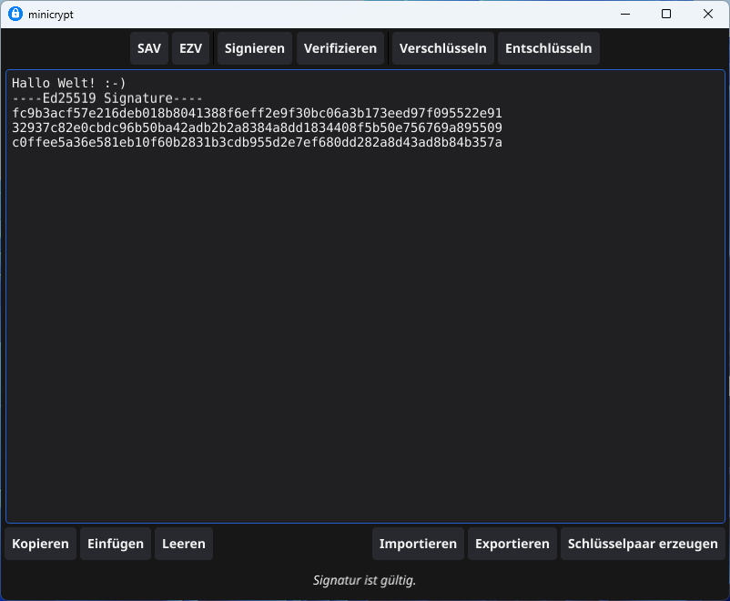
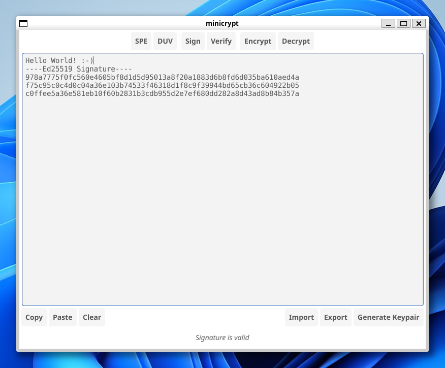

# minicrypt

The world's easiest to use public key encryption program,  
which produces no meta-data.😊

For deterministic key pair generation I recommend [red](https://github.com/706f6c6c7578/red)  
and for vanity key pairs I recommend [ve](https://github.com/706f6c6c7578/ve), which can be  
converted to PEM format with [hex2pem](https://github.com/706f6c6c7578/hex2pem).

## German Linux version with dark theme.

##  English Windows version with light theme.

If you like minicrypt, as much as I do, consider a small donation.  

Nym: n1yql04xjhmlhfkjsk8x8g7fynm27xzvnk23wfys   
BTC: bc1qhgek8p5qcwz7r6502y8tvenkpsw9w5yafhatxk    
XMR: 45TJx8ZHngM4GuNfYxRw7R7vRyFgfMVp862JqycMrPmyfTfJAYcQGEzT27wL1z5RG1b5XfRPJk97KeZr1svK8qES2z1uZrS

minicrypt is dedicated to Alice and Bob.

